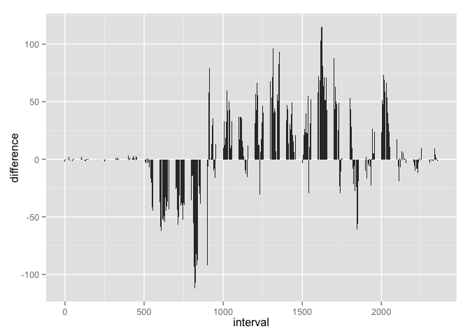

# Reproducible Research: Peer Assessment 1


## Loading and preprocessing the data

Load the data in a variable called 'unprocessed.activity.data'


```r
unprocessed.activity.data = read.csv("activity.csv", header = TRUE, sep = ",", stringsAsFactors = FALSE)
```

## What is mean total number of steps taken per day?

First, we remove the NA's from the steps variable.


```r
activity.data = subset(unprocessed.activity.data, steps >= 0)
```

We need the dplyr and ggplot2 packages for the following data manipulation


```r
library(dplyr)
```

```
## 
## Attaching package: 'dplyr'
## 
## The following objects are masked from 'package:stats':
## 
##     filter, lag
## 
## The following objects are masked from 'package:base':
## 
##     intersect, setdiff, setequal, union
```

```r
library(ggplot2)
```

Now, let's make a table of the total number of steps taken each day:


```r
grouped.by.day = group_by(activity.data, date)
total.steps.per.day = summarise(grouped.by.day, total.steps = sum(steps))
```

A histogram of the total number of steps taken each day, where each bar represents one thousand


```r
qplot(total.steps.per.day$total.steps, geom="histogram", xlab = "Total steps", binwidth = 1000)
```

 

Finally, what is the median and mean number of steps taken each day. First, let's see a summary of this variable:


```r
summary(total.steps.per.day$total.steps)
```

```
##    Min. 1st Qu.  Median    Mean 3rd Qu.    Max. 
##      41    8841   10760   10770   13290   21190
```

The Median and Mean are the third and fourth element in a table.


```r
Median = format(as.numeric(summary(total.steps.per.day$total.steps)[[3]][1]), scientific = FALSE)
Mean = format(as.numeric(summary(total.steps.per.day$total.steps)[[4]][1]), scientific = FALSE)
```

The Median number of steps is 10760, while the Mean is 10770.


## What is the average daily activity pattern?

In order to get the daily pattern, let's group the whole activity.data by interval.


```r
daily.pattern = group_by(activity.data, interval)
```

We need to show the average number of steps taken across all days, for each interval.


```r
average.steps.per.interval = summarise(daily.pattern, avg.steps = mean(steps))
ggplot(average.steps.per.interval, aes(x = interval, y = avg.steps)) + geom_line()
```

 

And we need to find the 5-minute interval which contains the maximum number of steps:


```r
max.interval = as.numeric(filter(average.steps.per.interval, avg.steps == max(avg.steps))[1,1])
```

The interval where the average number of steps is the highest is 835.

## Imputing missing values

We need the total number of missing values in the dataset:


```r
no.of.na = nrow(filter(unprocessed.activity.data, is.na(steps)))
```

The total number of missing values (NAs) is 2304.

The strategy for inputing the missing data will be replacing it with a rounded average number of steps for that interval, across all days.

For example, if the 800 interval is missing for a specific day, we will take an average of all 800-intervals that are not missing, round it to have zero digits, and replace the missing value with it. This means that all missing 800-intervals will be replaced with the same number.


```r
NA.steps = filter(unprocessed.activity.data, is.na(steps))
joined.datasets = left_join(NA.steps, average.steps.per.interval, by = "interval") %>% mutate(steps = round(avg.steps, 0)) %>% select(1:3)
NA.replaced = rbind(activity.data, joined.datasets) %>% arrange(date, interval)
```

The histogram shows the total number of steps taken each day, but for the new dataset that we have just created:


```r
NA.replaced.grouped.by.day = group_by(NA.replaced, date)
NA.replaced.total.steps.per.day = summarise(NA.replaced.grouped.by.day, total.steps = sum(steps))
qplot(NA.replaced.total.steps.per.day$total.steps, geom="histogram", xlab = "Total steps", binwidth = 1000)
```

 

Let's see what is the median and mean number of steps taken each day, for the new dataset:


```r
summary(NA.replaced.total.steps.per.day$total.steps)
```

```
##    Min. 1st Qu.  Median    Mean 3rd Qu.    Max. 
##      41    9819   10760   10770   12810   21190
```

```r
NA.replaced.Median = format(as.numeric(summary(NA.replaced.total.steps.per.day$total.steps)[[3]][1]), scientific = FALSE)
NA.replaced.Mean = format(as.numeric(summary(NA.replaced.total.steps.per.day$total.steps)[[4]][1]), scientific = FALSE)
```

The new Median number of steps is 10760, while the Mean is 10770. Before replacing the NAs, the Median was 10760, and the Mean was 10770.

This means that the strategy that was employed here, has not changed the Median nor the Mean of the dataset. That is good, because it means we have not skewed the results by replacing NAs.

## Are there differences in activity patterns between weekdays and weekends?

We need a new dataset, where a new factor variable is created, that contains two levels: Weekday and Weekend.


```r
NA.replaced$as.date = strptime(NA.replaced$date,format = "%Y-%m-%d")
weekend = c("Saturday", "Sunday")
NA.replaced$day.in.week = as.factor(ifelse(weekdays(NA.replaced$as.date) %in% weekend, "Weekend", "Weekday"))
activity.by.weekday = NA.replaced %>% select(1:3, 5)
```

Now we will see if there is a difference between weekdays and weekend, in a pattern based on 5-minute intervals.


```r
weekday.activity = filter(activity.by.weekday, day.in.week == "Weekday")
weekend.activity = filter(activity.by.weekday, day.in.week == "Weekend")

weekday.pattern = group_by(weekday.activity, interval)
weekend.pattern = group_by(weekend.activity, interval)

weekday.average.steps = summarise(weekday.pattern, avg.steps = mean(steps))
weekend.average.steps = summarise(weekend.pattern, avg.steps = mean(steps))

weekday.average.steps$day.in.week = as.factor("Weekday")
weekend.average.steps$day.in.week = as.factor("Weekend")

weekday.and.weekend = rbind(weekday.average.steps, weekend.average.steps)

ggplot(weekday.and.weekend, aes(interval, avg.steps)) + geom_line() + facet_grid(day.in.week ~ .)
```

 

There are obviously some differences between the patterns, but it's hard to see what exactly happens just by looking at these two graphs laid out like this.

We will modify a dataset a bit, to create a variable that shows a difference between weekday and weekend pattern, for each interval. The variable will be defined as *weekend - weekday*, which means if the line is in the positive part of the diagram, the weekend had more steps for that interval.


```r
difference.in.pattern = left_join(weekend.average.steps, weekday.average.steps, by = "interval") %>% mutate(difference = avg.steps.x - avg.steps.y)
ggplot(difference.in.pattern, aes(interval, difference)) + geom_bar(stat = "identity")
```

```
## Warning: Stacking not well defined when ymin != 0
```

 

What we can see from the last chart is that between 500 (5 am) and 900 (9 am), weekdays have on average 50 to 100 steps more than weekend days. After that, other than few exceptions (the most significant one being at around 6 pm), more steps are made during the weekend days.
